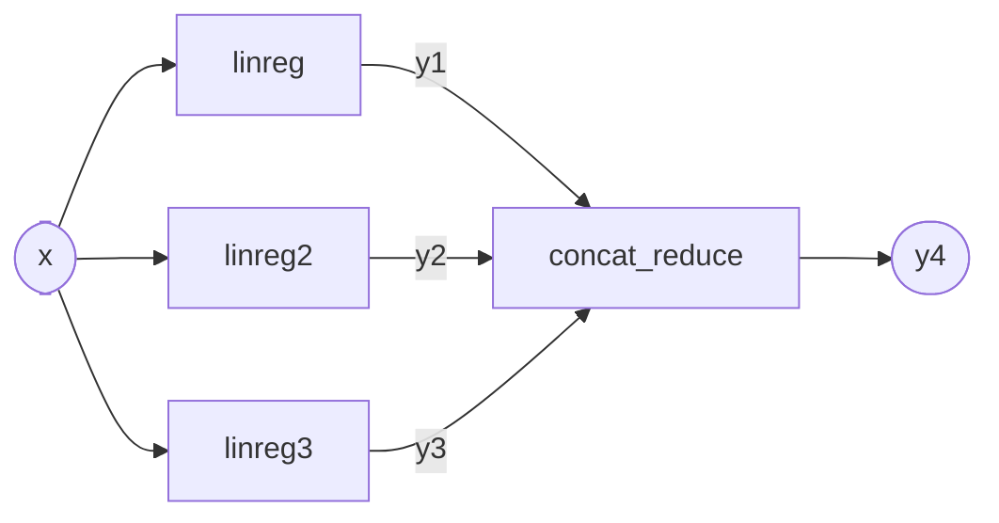

# The `pipeline` variant

| Key | Added in | Updated in | Classification | Operations | Content types | Schema |
| --- | --- | --- | --- | --- | --- | --- |
| `pipeline` | 0.1.0 | 0.1.0 | Strong portability, Strong execution durability | ALL | `NDJSON` | [`variant_pipeline.json`](../schemas/variant_pipeline.json) |

`pipeline` is a directed acyclic graph of first-party operations. The variant defines composition, not computation. It defines how values flow from one operation to the next, how the graph binds to the manifest's inputs and outputs, and how dynamic attributes reach the operations. Each node delegates to an op instance declared in `ops.json`. The operation named by that instance carries its own execution contract.

## Variant configuration

The `variant_config.json` of a `pipeline` artifact is a JSON object with one REQUIRED key.

| Field | Type | Required | Meaning |
| --- | --- | --- | --- |
| `nodes` | array of node objects | yes | The nodes of the graph, in execution order. MAY be empty. |

Each node object has four REQUIRED keys. A key with nothing to declare is written as an empty array or an empty object, not omitted.

| Field | Type | Required | Meaning |
| --- | --- | --- | --- |
| `op_instance_id` | string | yes | The `id` of an op instance declared in `ops.json`. |
| `inputs` | array of strings | yes | Value names read from the namespace and bound positionally to the op instance's inputs. |
| `outputs` | array of strings | yes | Value names written to the namespace, bound positionally to the op instance's outputs. |
| `extra_dynattrs` | object, string to string | yes | Dynamic attribute values applied to this node's invocation. |

The value of `op_instance_id` MUST match the `id` of an op instance present in `ops.json`. A consumer that cannot resolve it MUST reject the artifact. More than one node MAY reference the same op instance, and each reference is a separate invocation. Producers SHOULD NOT declare an op instance that no node references.

The strings in `inputs` and `outputs` are names in the pipeline's value namespace. They are not tensor names, and they have no relation to names inside the operation's own representation. The length of `inputs` MUST equal the number of entries in the op instance's `inputs` array. The length of `outputs` MUST equal the number of entries in its `outputs` array. A consumer MUST reject an artifact whose node arity disagrees with the op instance it names.

## Artifact layout

`pipeline` defines no layout under `variant_artifacts/`. Producers MUST NOT place files there.

## Execution semantics

A computation uses one flat value namespace shared by the whole graph. The model inputs seed it under the names declared in the manifest's `inputs`, and each node then extends it.

Nodes execute in declaration order. Before a node runs, every name in its `inputs` MUST already be bound, either as a model input or as an output of an earlier node. A consumer that finds an unbound name MUST report an error, and MUST NOT substitute a value. Producers MUST order `nodes` so that each node follows the nodes that produce its inputs. Any topological order of the graph is acceptable. The variant defines no reordering step. A graph written in a non-topological order is not a conforming artifact.

When a node completes, its results bind into the namespace under the names in its `outputs`, again positionally. Producers MUST NOT bind a name that a model input or an earlier output already binds. Consumers MUST reject an artifact that binds a name twice. The dependency structure of a conforming graph therefore follows from names alone.

A consumer MAY execute nodes concurrently, out of declaration order, or lazily, if the result is observationally equivalent to sequential execution in declaration order.

The meaning of the computation does not depend on the execution environment. Consumers MUST NOT treat a differently reconstructed environment as a change to what the artifact computes.

## Dynamic attributes

A node's `extra_dynattrs` merge over the caller-supplied attribute mapping, and the node's value wins for a name present in both. Values in `extra_dynattrs` are strings. The merge applies to that node's invocation only, and MUST NOT reach another node. A producer can therefore pin an attribute for one node and leave the rest of the graph under caller control. The op instance then resolves the merged mapping as [`../core.md`](../core.md) describes.

## Value validation

A consumer validates the values bound to a node's `inputs` before it invokes the node, against the op instance's input declarations. [`../core.md`](../core.md) states the validation requirement and the dtype and shape rules.

Validation is per node and per op instance. The manifest's `shape` entries describe the model's external interface and are not re-checked at each node.

## Model inputs and outputs

The `pipeline` variant supports only the `NDJSON` content type on the manifest's `inputs` and `outputs`. Producers MUST NOT declare a `JSON` entry on a `pipeline` artifact, and consumers MUST reject one.

A computation MUST produce every output the manifest declares. After the last node completes, the consumer reads each name in the manifest's `outputs` from the value namespace. An unbound declared output is an error: the consumer MUST report it, and MUST NOT return a partial result. Bound values that no declared output names stay internal to the computation.

## Example

In the graph below, three independent ONNX regression models read the model input `x`. A fourth ONNX node concatenates and reduces their results into the declared output `y4`.



The corresponding `variant_config.json`:

```json
{
    "nodes": [
        {
            "op_instance_id": "linreg",
            "inputs": ["x"],
            "outputs": ["y1"],
            "extra_dynattrs": {}
        },
        {
            "op_instance_id": "linreg2",
            "inputs": ["x"],
            "outputs": ["y2"],
            "extra_dynattrs": {}
        },
        {
            "op_instance_id": "linreg3",
            "inputs": ["x"],
            "outputs": ["y3"],
            "extra_dynattrs": {}
        },
        {
            "op_instance_id": "concat_reduce",
            "inputs": ["y1", "y2", "y3"],
            "outputs": ["y4"],
            "extra_dynattrs": {}
        }
    ]
}
```

The three regression nodes are independent, so a consumer may run them concurrently. `concat_reduce` follows the nodes that bind its three input names, which satisfies the ordering requirement. Its output `y4` is the manifest's declared output. Each `op_instance_id` resolves to an entry in `ops.json` that declares the node's dtypes and shapes.
